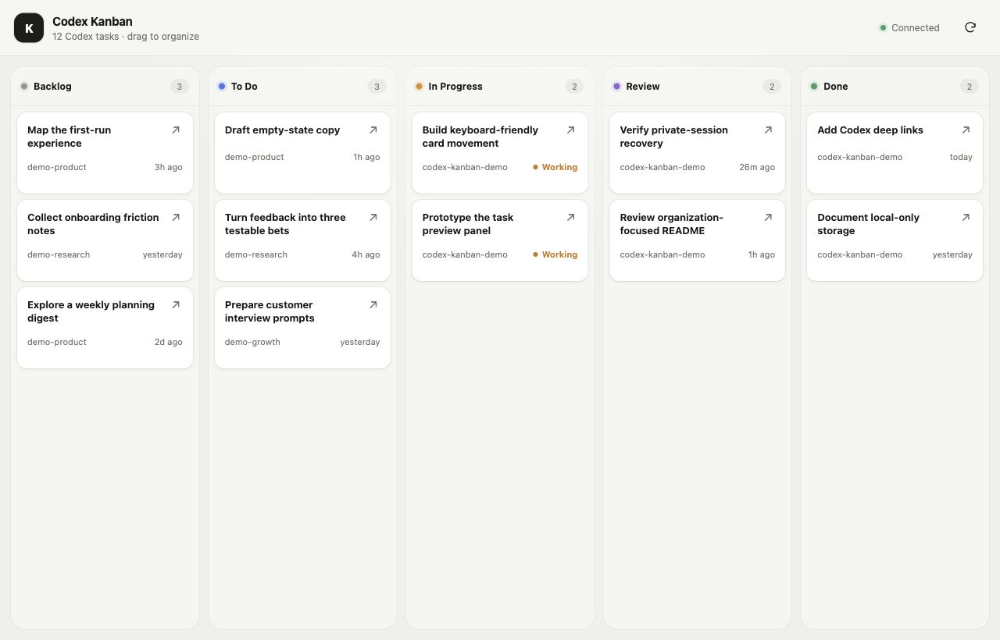

# Codex Kanban

My Codex sidebar became a second inbox. I needed columns.

Codex Kanban is a pure, local Kanban view of the tasks already in Codex. Drag them around for your own mental sanity. When it is time to work, open the exact task in Codex.

Built for people who struggle to keep parallel AI work organized. Me included.



_Fake data. Your chaos may vary._

## That is basically the entire product

- Move tasks between Backlog, To Do, In Progress, Review, and Done.
- Hide tasks you do not need to see.
- Open a read-only preview.
- Jump directly into the real task in Codex.

It cannot create Codex tasks, send messages, answer questions, approve actions, or edit Codex data. Its only writes are local board metadata: task ID, column, order, and hidden state.

## Things it proudly does not have

- No accounts.
- No telemetry.
- No hosted app or data server.
- No cloud database.
- No second chat box.
- No productivity empire quietly becoming your new full-time job.

One tiny local process runs on your own computer while the real board is open. The public demo is a static fake-data page and cannot access Codex.

## Quick start

You need macOS, Node.js 20 or newer, and the [Codex CLI](https://learn.chatgpt.com/docs/codex/cli) installed and signed in. Windows and Linux are not yet verified.

```sh
npx --yes github:luke-toledo/codex-kanban
```

The command downloads the current source from GitHub, starts the board, and opens a token-authenticated local tab at `127.0.0.1:4173`. Keep the terminal open. Press `Ctrl+C` to stop it; run the same command to start again. Your board positions survive restarts.

Only run this command from a repository or fork you trust. For a reproducible install, clone the repository, inspect it, check out a commit you trust, and run `npm start`.

## Is any data shared?

Codex Kanban itself sends no chat or board data to the project author or to a remote project server. It has no analytics, ads, trackers, cloud database, third-party browser assets, or third-party npm runtime packages.

| Data | Where it goes | Saved by Kanban? |
| --- | --- | --- |
| Task titles, folders, last-updated time, and status | Local Codex process → local server → your browser | No |
| A conversation you open, including messages and visible activity | Local Codex process → local server → your browser | No |
| Card ID, column, order, and hidden state | Local board file on your computer | Yes |
| Private launch key | Server memory and port-scoped browser session storage | Valid only for that server process; browser copy normally lasts until the tab closes |

The browser temporarily holds the Codex content it displays. Browser extensions, screen sharing, screenshots, and anyone using your unlocked computer may still see it.

The separately installed Codex app and CLI keep their normal OpenAI network and data behavior. This project reads from Codex locally; it does not change or replace Codex's own data controls. Installing or updating with `npx` contacts GitHub to download executable source.

## Security and safe use

The current source and live HTTP boundary were reviewed for the intended local, single-user setup. No critical or high-severity issue was found in that boundary. This is not a formal third-party audit.

Use it like this:

- Run it only on your own trusted computer and browser profile.
- Use the local tab opened by the command.
- Never share the launch URL; restarting the app rotates its private key.
- Never expose port `4173` through a tunnel, proxy, LAN address, container port, or public host.
- Run one instance at a time and stop it with `Ctrl+C` when you are finished.
- Never run an untrusted fork. The downloaded code runs with your user permissions and can read the Codex data available to your account.

The app binds only to IPv4 loopback, checks the exact Host and mutation Origin, rejects cross-site browser requests, and stores a per-launch 256-bit key in port-scoped browser session storage. It also disables CORS and applies a restrictive Content Security Policy. Calls to the Codex App Server are allowlisted to initialization, task listing, and task reading; unexpected write or approval requests fail closed.

See [SECURITY.md](SECURITY.md) for the full threat model and known limitations.

## Local storage

The board file stores only `{ threadId, column, order, hidden }`. No transcript or credential is written to that file.

- macOS: `~/Library/Application Support/codex-kanban/board.json`
- Linux: `~/.local/state/codex-kanban/board.json` or `$XDG_STATE_HOME`
- Windows: `%APPDATA%\\codex-kanban\\board.json`

New directories and files are created with private user permissions where the operating system supports them. Writes use a temporary file and atomic rename, so a failed write cannot leave half-written JSON. Moves appear immediately; if saving fails, the board reloads the last saved state.

Early local versions stored `data/board.json` inside the repository. The current app copies that file once and leaves it as a backup. After confirming the new board is correct, you may delete that old file yourself.

## Fork or develop

Fork the repository, review the changes, then substitute your username:

```sh
npx --yes github:YOUR_GITHUB_USERNAME/codex-kanban
```

For local development:

```sh
git clone https://github.com/luke-toledo/codex-kanban.git
cd codex-kanban
npm start
```

Run the tests with:

```sh
npm test
```

The optional live check lists tasks and reads one existing task without creating or changing anything:

```sh
npm run test:live
```

## How it works

The Node server starts `codex app-server --stdio` as a child process. The browser talks only to the local Node server on `127.0.0.1`; the server talks to Codex over local standard input/output. Card links use the [official Codex deep-link format](https://learn.chatgpt.com/docs/reference/commands#deep-links).

Codex Desktop does not currently share its live running state with this separate read-only process. Kanban shows **Working** when it can verify that state and **Unknown** when it cannot, instead of guessing.

Codex App Server is experimental. This release is tested with `codex-cli 0.150.1`, so a future CLI protocol change may require an update.

MIT licensed. Unofficial and not affiliated with OpenAI. Made by [Luke](https://x.com/lukesvg).
